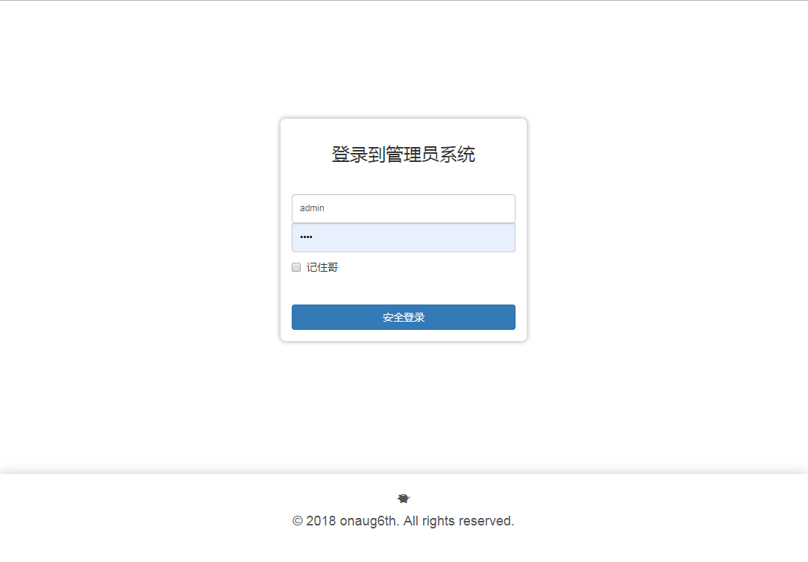
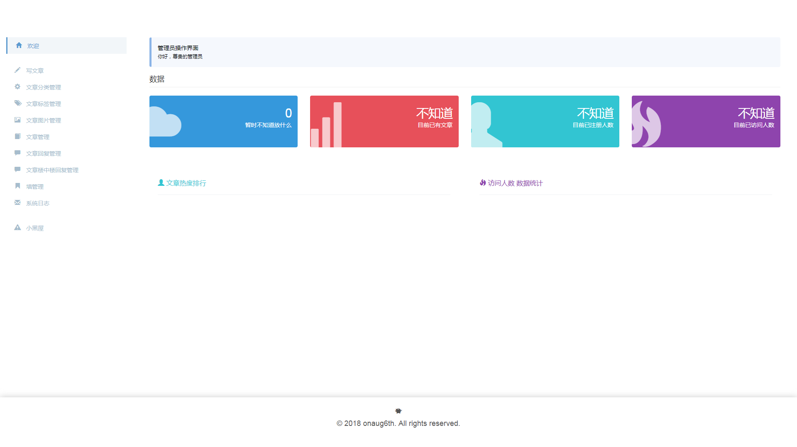
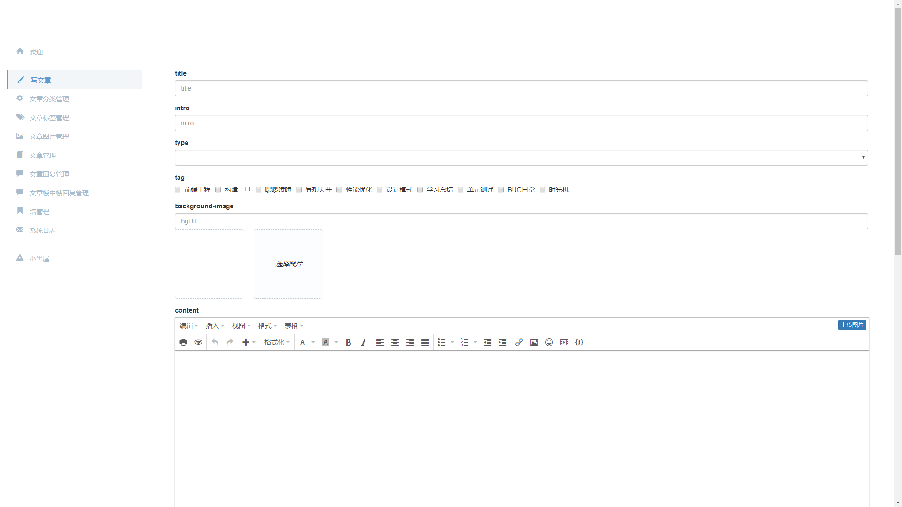
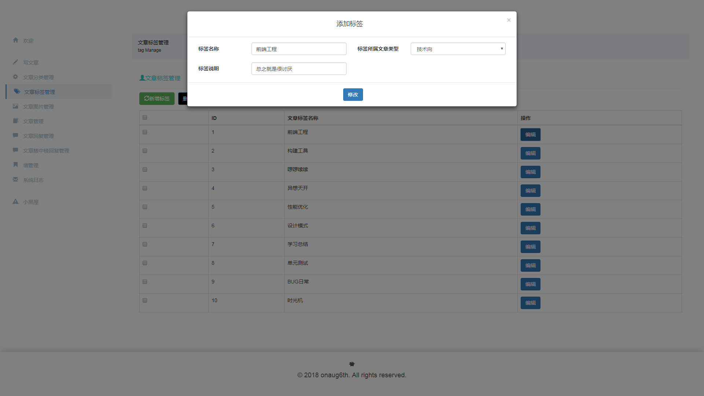

# onaug6th

个人博客的后台管理系统

个人博客代码：https://github.com/onaug6th/onaug6th

服务端代码: https://github.com/onaug6th/onaug6th-backEnd

## 概况

前端框架    vue.js

服务端语言   node.js

数据库       mysql

对象关系模型  sequelize

### 用法

```
git clone https://github.com/onaug6th/onaug6th-admin

cd onaug6th

npm install 

npm run serve
```
默认会开启8080端口，访问localhost:8080即可打开项目。

### 构建

```
npm run build
```
构建完毕的压缩代码，会在 `/dist` 文件夹中。

## 部分截图






## 开源许可证

MIT
